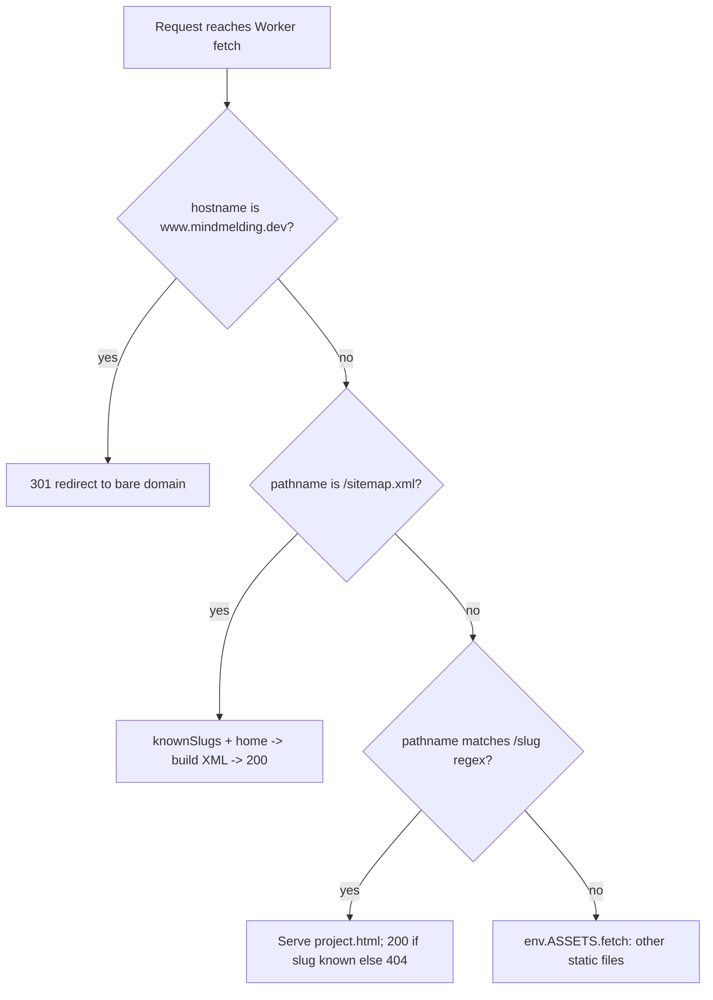

# mindmelding.dev Sitemap and Robots.txt - Plan

## Goal Capsule

- **Objective:** A search engine crawling mindmelding.dev can discover every page — the home page and each project page — without anyone maintaining a page list by hand.
- **Means:** Serve `robots.txt` as a static asset; generate `sitemap.xml` inside `worker.js` at request time from the same `knownSlugs` source the `/<slug>` route already uses (KTD1, KTD2).
- **Authority hierarchy:** Linear issue BUO-38 acceptance criteria (AE1-AE3) are authoritative; this plan does not add or remove scope beyond them.
- **Stop conditions:** All three acceptance criteria verified by `wrangler dev` + `curl`; nothing else in `worker.js` behavior changes.
- **Execution profile:** Lightweight, single PR, no build step, no CI change.
- **Who finishes:** The implementing agent lands both units, runs the verification commands, and includes their output in the PR description.

---

## Product Contract

### Summary

Add a static `robots.txt` that allows all crawlers and points to the sitemap, and a `sitemap.xml` generated by `worker.js` at request time that lists the home page plus every project slug, so the two files never drift from `projects.js`.

### Problem Frame

mindmelding.dev has no `robots.txt` or `sitemap.xml` today. Project pages exist only as `/<slug>` routes resolved at request time from `projects.js` (`worker.js:7-19`); nothing enumerates them for a crawler. Docs sites under the same domain (e.g. `/docs-kit/docs/`) already publish their own sitemaps and are out of scope here.

### Requirements

- R1. `GET /robots.txt` returns HTTP 200 with a plain-text body that allows all crawlers and includes the line `Sitemap: https://mindmelding.dev/sitemap.xml`. (Covers AE1)
- R2. `GET /sitemap.xml` returns HTTP 200 with an XML body listing the home page (`https://mindmelding.dev/`) and every slug `knownSlugs` currently returns, each as `https://mindmelding.dev/<slug>`. (Covers AE2)
- R3. Adding a project to `projects.js` changes the set `sitemap.xml` lists on the next request, with no edit anywhere else. (Covers AE2)
- R4. `GET /nope` (or any path not in `knownSlugs`) still returns 404; the home page and every existing project page still return 200. (Covers AE3)

---

## Planning Contract

### Key Technical Decisions

- KTD1. **Serve `robots.txt` as a static asset file, not through `worker.js`.** Its content is fixed and never depends on `projects.js`, so it fits the same pattern as `index.html`, `styles.css`, and `app.js` — files Cloudflare's asset binding serves directly, before the Worker ever runs (`worker.js:1-2` comment: "Runs only when no file matches the path"). Rejected alternative: add a `/robots.txt` branch in `worker.js` — unnecessary Worker invocation for content that never changes.
- KTD2. **Generate `sitemap.xml` inside `worker.js`'s `fetch` handler, reusing the existing `knownSlugs(env, url)` helper.** There is no build step (per issue Notes), so the file can't be pre-generated at deploy time, and `knownSlugs` is already the single source of truth the `/<slug>` route uses for its own 200/404 decision (`worker.js:28-32`) — reusing it is what makes R3 hold for free, and keeps the sitemap and the project pages structurally unable to disagree.
- KTD3. **Hardcode the canonical origin `https://mindmelding.dev` for every URL written into `sitemap.xml`, rather than deriving it from the incoming request's `url.hostname`.** AE1 already hardcodes this same origin in the required `Sitemap:` line. Requests can arrive via `www.mindmelding.dev` (redirected before reaching this code), a Workers preview URL, or `localhost` under `wrangler dev`; in every case the sitemap must still advertise the production URLs a crawler will actually fetch. Rejected alternative: build the origin from `url.hostname` — would leak `localhost`/preview hosts into the sitemap during local verification and disagree with the static `robots.txt` line whenever accessed via a non-canonical host.
- KTD4. **Project URLs in `sitemap.xml` carry no trailing slash** (`https://mindmelding.dev/<slug>`), matching R2's literal text and the site's own existing link convention (`app.js`: `name.href = "/" + window.projectSlug(p)`, no trailing slash). Rejected alternative: a trailing slash on each `<loc>` — both forms resolve to 200 against the `/<slug>/?` route regex, but a sitemap should advertise one canonical form, and the site's own generated links already establish which one.

### High-Level Technical Design

`worker.js`'s `fetch` handler gains one new branch. Static assets (including the new `robots.txt`) are served by the platform before `fetch` runs at all, so they don't appear in this flow.



### Assumptions

- Cloudflare's static-asset serving sets `Content-Type: text/plain` for `.txt` files and `Content-Type: application/xml` (or similar) is set explicitly by the Worker for the generated response — verified in U1/U2 verification rather than asserted here.
- `/robots.txt` and `/sitemap.xml` never match the existing `/^\/([a-z0-9-]+)\/?$/` slug regex because `.` is not in the character class — confirmed by reading `worker.js:28`, not an assumption requiring a code change.

---

## Implementation Units

### U1. Static `robots.txt`

- **Goal:** Serve a crawlable, correct `robots.txt` at the domain root with zero Worker logic (R1, KTD1).
- **Requirements:** R1
- **Dependencies:** none
- **Files:**
  - `robots.txt` (new, repo root)
- **Approach:**
  1. Create `robots.txt` at the repo root (same directory as `index.html`, alongside the other static assets `wrangler.jsonc`'s `assets.directory: "."` serves).
  2. Content: `User-agent: *`, `Allow: /`, a blank line, then `Sitemap: https://mindmelding.dev/sitemap.xml` — matching AE1's literal text.
  3. No `.assetsignore` change needed; `robots.txt` is not in its exclusion list.
- **Test expectation: none** — pure static content, no branching logic to exercise beyond the HTTP-level check below.
- **Verification:** Covers AE1. Under `npx wrangler dev`, `curl -i http://localhost:<port>/robots.txt` returns `HTTP/1.1 200`, a `content-type` starting with `text/plain`, and a body containing `Sitemap: https://mindmelding.dev/sitemap.xml`.

### U2. Dynamic `sitemap.xml` in `worker.js`

- **Goal:** Generate a sitemap at request time that always matches the slugs `knownSlugs` currently returns, plus the home page (R2, R3, KTD2, KTD3).
- **Requirements:** R2, R3
- **Dependencies:** none (independent of U1)
- **Files:**
  - `worker.js` (modify)
- **Approach:**
  1. Add a constant for the canonical origin, `https://mindmelding.dev` (KTD3), reused by the sitemap URLs.
  2. In `fetch`, after the `www` redirect check and before the `/<slug>` regex match, add a branch for `url.pathname === "/sitemap.xml"`.
  3. In that branch, call the existing `knownSlugs(env, url)` and build a `urlset` XML document with one `<url><loc>` entry for the canonical origin itself (home page) and one per slug, no trailing slash (`<origin>/<slug>`, KTD4).
  4. Return the XML with status 200 and a `content-type` of `application/xml; charset=utf-8`.
- **Technical design:** (directional, not literal code)
  ```text
  const SITE_ORIGIN = "https://mindmelding.dev";

  function sitemapXml(slugs) {
    urls = [SITE_ORIGIN + "/", ...[...slugs].map(s => SITE_ORIGIN + "/" + s)]
    return xml <urlset>...<url><loc>each</loc></url>...</urlset>
  }

  // inside fetch, after the www-redirect check:
  if (url.pathname === "/sitemap.xml") {
    slugs = await knownSlugs(env, url)
    return new Response(sitemapXml(slugs), { headers: { "content-type": "application/xml; charset=utf-8" } })
  }
  ```
- **Patterns to follow:** Reuse `knownSlugs(env, url)` (`worker.js:7-19`) exactly as the `/<slug>` branch does (`worker.js:29-32`) — do not re-parse `projects.js` a second way.
- **Test scenarios:**
  - Covers AE2. `GET /sitemap.xml` returns 200, `content-type` containing `xml`, and a body listing the home page URL plus a `<loc>` for every slug currently in `projects.js` (as of this plan: `loyalty-mcp`, `buoy`, `swap-my-stack`, `front-of-house`, `summit` — verify the actual live set at test time since `projects.js` may have changed).
  - Covers AE2 / R3. Temporarily add a throwaway entry to `projects.js`, formatted like the existing entries (`{` on its own line — `knownSlugs`'s parser at `worker.js:12` splits on `\n\s*\{\s*\n`, so a single-line `{ title: "..." }` entry is invisible to it), e.g.:
    ```js
    {
      title: "Plan Test Project",
    },
    ```
    Re-request `/sitemap.xml` under the running `wrangler dev`, confirm `https://mindmelding.dev/plan-test-project` appears (no trailing slash, KTD4) with no other edit, then revert `projects.js`.
  - Edge case: a project entry with an explicit `slug:` field (none currently in `projects.js`, but `knownSlugs` supports it) still produces a valid `<loc>` — exercised implicitly since `knownSlugs` is shared code already covering this case for `/<slug>` routing.
- **Verification:** `npx wrangler dev`, then `curl -i http://localhost:<port>/sitemap.xml` shows 200 + XML content-type + expected `<loc>` entries; repeat after the temporary `projects.js` edit from the second test scenario.

---

## Verification Contract

No test runner exists in this repo (confirmed: no `package.json` test script, no CI test job for this repo). Verification is manual, via `npx wrangler dev` plus `curl`, with commands and output captured in the PR description per the issue's Notes.

| Check | Command | Expected |
|---|---|---|
| AE1: robots.txt | `curl -i http://localhost:<port>/robots.txt` | `HTTP/1.1 200`, `content-type: text/plain...`, body has `User-agent: *`, `Allow: /`, `Sitemap: https://mindmelding.dev/sitemap.xml` |
| AE2: sitemap.xml | `curl -s http://localhost:<port>/sitemap.xml` | 200, XML, home page + one `<loc>` per current `projects.js` slug |
| AE2: sitemap follows projects.js | add throwaway project to `projects.js`, re-curl `/sitemap.xml`, revert | new slug appears with no other edit |
| AE3: unknown path | `curl -i http://localhost:<port>/nope` | `HTTP/1.1 404` (unchanged) |
| AE3: home page | `curl -i http://localhost:<port>/` | `HTTP/1.1 200` (unchanged) |
| AE3: each project page | `curl -i http://localhost:<port>/<slug>/` for every slug in `projects.js` | `HTTP/1.1 200` (unchanged) |

## Definition of Done

- R1-R4 verified by the commands above, with actual output captured for the PR.
- `worker.js` diff is limited to the new `/sitemap.xml` branch and its helper; the `/<slug>` and static-asset fallthrough logic is untouched.
- `robots.txt` exists at the repo root and is not listed in `.assetsignore`.
- No `.github/workflows/` file touched; no secrets added.
